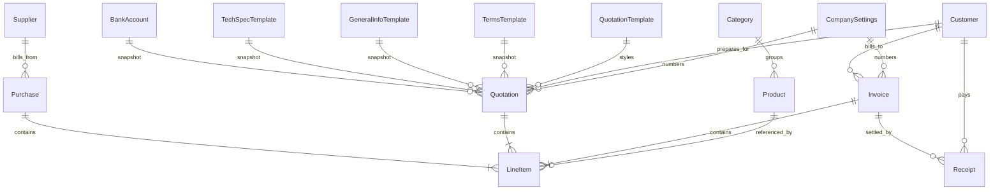

# Business Management System (BMS) — Complete System Architecture & Project Understanding

> **Document Version:** 1.0.0  
> **Target Audience:** Senior Software Engineers, Technical Architects, AI Agents  
> **Status:** Authoritative Snapshot of Existing Codebase  
> **Attribution:** Built by Mohammed Maaz — MMA  

---

## 1. Executive Summary & Purpose

The **Business Management System (BMS)** (also referenced internally as *Business Hub* or `tanstack_start_ts`) is a high-performance, single-user, **offline-first** ERP/business management application designed specifically for small business owners, contractors, and fabricators operating in the Indian market.

### Core Philosophy
1. **Local-First & Zero-Cloud:** There is no backend server, no external REST/GraphQL API, no authentication service, and no remote database. Every record, document, customer profile, transaction, master preset, and company setting lives inside the client browser's **IndexedDB** (`bms_db_v1`), orchestrated via **Dexie.js**.
2. **Zero Subscription / No Account Overhead:** The user is not required to create a cloud account or maintain ongoing internet connectivity. The entire application can be installed as a Progressive Web App (PWA) and operated completely offline.
3. **Indian Commercial & Tax Compliance:** The system handles Indian Goods and Services Tax (GST) paradigms, including dual-split CGST + SGST (intra-state transactions) and unified IGST (inter-state transactions), HSN codes, Indian number formatting (crore, lakh, thousand), and full Indian currency-to-words transcription (with Paise).
4. **Professional Quotation Engine:** Beyond standard invoice-to-ledger tracking, BMS features an advanced fabrication/commercial quotation generator supporting multi-page vector PDF and Microsoft Word (`.docx`) generation, customizable design templates, technical specifications, and historical snapshotting.

---

## 2. Technology Stack & Key Dependencies

| Layer | Library / Tool | Version | Purpose in BMS |
| :--- | :--- | :--- | :--- |
| **Framework & Shell** | React | `^19.2.0` | Declarative UI foundation |
| **Meta-Framework** | TanStack Start | `^1.168.26` | SSR-capable app shell, server-entry error boundary |
| **Routing** | TanStack Router | `^1.170.16` | File-based routing with intent-driven route preloading |
| **Data Query Cache** | TanStack Query | `^5.101.1` | Client router context provider |
| **Database Engine** | Dexie.js | `^4.4.4` | IndexedDB abstraction layer (`bms_db_v1`) |
| **Reactivity** | `dexie-react-hooks` | `^4.4.0` | `useLiveQuery` integration for automatic UI re-renders |
| **CSS & Theme** | Tailwind CSS | `^4.2.1` | Modern `@theme` CSS tokens, soft-brutalist styling |
| **UI Components** | shadcn/ui & Radix UI | Various | Accessible primitives (Dialogs, Selects, Tabs, Tables) |
| **Icons** | Lucide React | `^0.575.0` | Application-wide icon set |
| **Motion** | Framer Motion | `^12.42.2` | Page route entrances and dialog transition animations |
| **Drag & Drop** | `@dnd-kit/core` & `sortable`| `^6.3.1` / `^10.0.0` | Reordering line items in the Quotation editor |
| **Vector PDF Engine** | `jspdf` + `jspdf-autotable` | `^4.2.1` / `^5.0.8` | Multi-page vector quotation rendering |
| **Canvas PDF Engine** | `html2canvas` | `^1.4.1` | Rasterized PDF export for generic invoices/purchases |
| **Word Export** | `docx` | `^9.7.1` | In-browser binary generation of Microsoft Word `.docx` |
| **Charts** | Recharts | `^2.15.4` | Dashboard 6-month sales vs. purchase bar charts |
| **Notifications** | Sonner | `^2.0.7` | Action feedback toasts |
| **Runtime & Build** | Bun & Vite | Vite `^8.0.16` | Development server, bundling, and client build |

---

## 3. Directory Layout & Key File Map

```
c:/Users/maazm/Downloads/Business Hub/
├── .lovable/                      # Lovable platform project metadata and historical plan
│   ├── plan.md                    # Historical specification for Quotation Module v2
│   └── project.json               # Platform schema and template identifier
├── docs/                          # Architectural documentation
│   ├── ARCHITECTURE.md            # Stack summary, rendering, and performance rules
│   ├── AUTH-AND-SESSION.md        # Session mechanics and credentials
│   ├── DATA-MODEL.md              # Table definitions, versions, and schema fields
│   ├── DESIGN-SYSTEM.md           # Tokens, soft-brutalist guidelines, scrollbar rules
│   ├── DEVELOPMENT.md             # Development commands and conventions
│   ├── EXPORTS.md                 # PDF and DOCX pipelines
│   ├── MODULES.md                 # Summary of module capabilities
│   └── QUOTATION-MODULE.md        # Deep dive into the quotation form & masters
├── public/                        # Static assets, PWA icons, SEO configuration
│   ├── favicon.png                # Primary browser favicon
│   ├── apple-touch-icon.png       # iOS home-screen icon
│   ├── icon-192.png, icon-512.png # PWA manifest icons
│   ├── manifest.webmanifest       # Standalone PWA configuration
│   ├── robots.txt                 # Search engine directives (public routes only)
│   └── sitemap.xml                # Sitemap for public landing routes
├── src/
│   ├── assets/
│   │   └── bms-logo.png.asset.json# Remote logo metadata and URI
│   ├── components/
│   │   ├── app/                   # Domain-specific application components
│   │   │   ├── AppShell.tsx       # Authenticated layout (Sidebar + Topbar + Page)
│   │   │   ├── ConfirmDialog.tsx  # Shared confirmation modal for destructive actions
│   │   │   ├── DocumentListPage.tsx# Core generic document engine (Invoices, Purchases)
│   │   │   ├── DocumentPrint.tsx  # On-screen A4 print canvas for generic documents
│   │   │   ├── GlobalSearch.tsx   # Command palette search (⌘K / Ctrl+K)
│   │   │   ├── LineItemsEditor.tsx# Line items table with tax and discount math
│   │   │   ├── ListHelpers.tsx    # ListToolbar, EmptyState, usePagination, Pager
│   │   │   ├── PublicShell.tsx    # Unauthenticated layout (Login, About, Contact)
│   │   │   ├── QuotationForm.tsx  # Multi-tab quotation creator & editor
│   │   │   ├── QuotationsPage.tsx # Quotation list, filters, sorting, row actions
│   │   │   ├── Sidebar.tsx        # Navigation sidebar with responsive mobile sheet
│   │   │   ├── Skeletons.tsx      # Table and page loading skeleton placeholders
│   │   │   └── Topbar.tsx         # Top bar with title, theme switch, search, logout
│   │   └── ui/                    # Vendor shadcn/ui and Radix UI components
│   ├── hooks/
│   │   └── use-mobile.tsx         # Mobile breakpoint hook (768px threshold)
│   ├── lib/                       # Pure utility modules and business logic
│   │   ├── calc.ts                # Mathematical calculations (lines, totals, stock)
│   │   ├── db.ts                  # Dexie schema, migrations, TypeScript interfaces
│   │   ├── error-capture.ts       # Global error logging capture
│   │   ├── error-page.ts          # Server-rendered 500 error page fallback
│   │   ├── format.ts              # Currency, date, Indian number-to-words helpers
│   │   ├── logoData.ts            # Base64 logo loader for PDF/DOCX embedding
│   │   ├── lovable-error-reporting.ts # Client error reporter
│   │   ├── pdf.ts                 # html2canvas + jsPDF export & browser print
│   │   ├── quotationExport.ts     # Vector PDF & DOCX generator for quotations
│   │   ├── session.ts             # Authentication storage and 24h expiration
│   │   ├── useInitialLoading.ts   # 120ms skeleton debounce hook
│   │   ├── useLive.ts             # SSR-safe reactive Dexie hooks (`useLive`, `useLiveOne`)
│   │   └── utils.ts               # CSS class merge utility (`cn`)
│   ├── routes/                    # File-based routing table
│   │   ├── __root.tsx             # Root HTML shell, global Toaster, SEO meta
│   │   ├── _app.tsx               # Private route layout & authentication gate
│   │   ├── _app.index.tsx         # Dashboard overview (KPIs, charts, low stock)
│   │   ├── _app.customers.tsx     # Customer directory CRUD
│   │   ├── _app.suppliers.tsx     # Supplier directory CRUD
│   │   ├── _app.products.tsx      # Product catalog & stock inventory
│   │   ├── _app.categories.tsx    # Product categories
│   │   ├── _app.quotations.tsx    # Quotations module container
│   │   ├── _app.masters.tsx       # Quotation master templates (Sizes, Terms, Specs)
│   │   ├── _app.invoices.tsx      # GST Invoices container
│   │   ├── _app.receipts.tsx      # Payment receipts & invoice settlement
│   │   ├── _app.purchases.tsx     # Purchase bills container
│   │   ├── _app.ledger.tsx        # Customer and Supplier debit/credit ledgers
│   │   ├── _app.reports.tsx       # Sales, purchase, stock, profit, GST reports
│   │   ├── _app.settings.tsx      # Company profile, numbering, bank, branding
│   │   ├── _app.backup.tsx        # JSON database export, import, and wipe
│   │   ├── login.tsx              # Single-user sign-in page
│   │   ├── about.tsx              # Public about page
│   │   └── contact.tsx            # Public contact page
│   ├── routeTree.gen.ts           # Auto-generated TanStack Router tree
│   ├── router.tsx                 # Router instance creation & preloading rules
│   ├── server.ts                  # Server entry error normalizer
│   ├── start.ts                   # TanStack Start initialization & error middleware
│   └── styles.css                 # Global CSS, Tailwind v4 tokens, soft-brutalist theme
├── components.json                # shadcn configuration file
├── package.json                   # Project scripts and dependencies
├── tsconfig.json                  # TypeScript compiler options and `@/*` alias
└── vite.config.ts                 # Vite bundler configuration
```

---

## 4. Authentication, Session & Access Control

### 4.1 Single-User Authentication Architecture
BMS does not interface with an authentication server, OAuth provider, or JWT service. It is designed as a single-owner application with credentials hardcoded in [`src/lib/session.ts`](file:///c:/Users/maazm/Downloads/Business%20Hub/src/lib/session.ts):

* **Configured Email:** `admin@business.local`
* **Configured Password:** `Admin@123`

### 4.2 Session Lifecycle & Storage
1. **Storage Mechanism:** The authenticated session is recorded in the browser's `localStorage` under the key:
   ```json
   // Key: "bms_session_v1"
   {
     "email": "admin@business.local",
     "expiresAt": 1741829392000
   }
   ```
2. **Session TTL:** Fixed at **24 hours** (`24 * 60 * 60 * 1000` ms) from login.
3. **Passive Expiration:** Any invocation of `getSession()` inspects `Date.now() > s.expiresAt`. If expired, it removes the key and returns `null`.
4. **Active Route Protection (`src/routes/_app.tsx`):**
   * **Pre-render Interception:** In `beforeLoad`, if `typeof window !== "undefined"` and `!isAuthenticated()`, the router throws a redirect to `/login`. This prevents flash-of-unauthenticated-content (FOUC).
   * **Runtime Guard:** The `AppGuard` component mounts a 60-second polling interval, plus listeners on the `window` `"focus"` and `document` `"visibilitychange"` events. If the 24-hour expiration elapses mid-session, the user is immediately forced to `/login`.
5. **Sign-In Transition:** [`src/routes/login.tsx`](file:///c:/Users/maazm/Downloads/Business%20Hub/src/routes/login.tsx) simulates an entrance delay of 500ms followed by an animated full-screen overlay ("Entering your workspace…") for 900ms before navigating to `/`.

### 4.3 Public vs. Private Routes
* **Public Routes:** `/login`, `/about`, `/contact`. Rendered inside [`PublicShell`](file:///c:/Users/maazm/Downloads/Business%20Hub/src/components/app/PublicShell.tsx) with header navigation and footer attribution to Mohammed Maaz (MMA).
* **Private Business Routes:** All paths under `_app` (`/`, `/customers`, `/suppliers`, `/products`, `/categories`, `/quotations`, `/masters`, `/invoices`, `/receipts`, `/purchases`, `/ledger`, `/reports`, `/settings`, `/backup`). Rendered inside [`AppShell`](file:///c:/Users/maazm/Downloads/Business%20Hub/src/components/app/AppShell.tsx).

---

## 5. Data Model & Database Architecture

Database implementation is centralized in [`src/lib/db.ts`](file:///c:/Users/maazm/Downloads/Business%20Hub/src/lib/db.ts). Database name: **`bms_db_v1`**.

### 5.1 Dexie Table Schema & Versioning



#### Version 1 (Core Entity Stores)
* `companySettings: "id"` (Primary key `"singleton"`)
* `customers: "id, name, createdAt"`
* `suppliers: "id, name, createdAt"`
* `categories: "id, name"`
* `products: "id, name, categoryId, createdAt"`
* `quotations: "id, number, date, customerId, createdAt"`
* `invoices: "id, number, date, customerId, status, createdAt"`
* `receipts: "id, number, date, customerId, invoiceId, createdAt"`
* `purchases: "id, number, date, supplierId, createdAt"`

#### Version 2 (Quotation Masters & Templates — Additive)
* `sizes: "id, label, createdAt"`
* `termsTemplates: "id, name, createdAt"`
* `generalInfoTemplates: "id, name, createdAt"`
* `techSpecTemplates: "id, name, kind, createdAt"`
* `bankAccounts: "id, bankName, createdAt"`
* `quotationTemplates: "id, name, createdAt"`

### 5.2 Detailed Entity Definitions

#### 1. CompanySettings (`id: "singleton"`)
Holds company profile, legal details, document sequence numbers, and print assets.
* **Fields:** `id`, `name`, `logo` (base64 data URL), `address`, `mobile`, `altMobile`, `email`, `website`, `gstin`, `pan`, `cin`, `bankName`, `bankAccount`, `bankIfsc`, `bankBranch`, `upiId`, `terms`, `declaration`, `authorizedSignatory`, `signature` (data URL), `stamp` (data URL), `currency` (`"INR"`), `currencySymbol` (`"₹"`), `invoicePrefix`, `quotationPrefix`, `receiptPrefix`, `purchasePrefix`, `nextInvoiceNo`, `nextQuotationNo`, `nextReceiptNo`, `nextPurchaseNo`.
* **Numbering Generator (`nextNumber(kind)`):** Reads current counter, increments by 1, updates database, and returns formatted string padded to 4 digits (e.g., `QT-0001`, `INV-0042`).

#### 2. Customer & Supplier
* **Customer:** `id`, `name`, `company`, `mobile`, `email`, `gstin`, `address`, `city`, `state`, `pincode`, `openingBalance`, `createdAt`.
* **Supplier:** `id`, `name`, `company`, `mobile`, `email`, `gstin`, `address`, `openingBalance`, `createdAt`.

#### 3. Product & Category
* **Category:** `id`, `name`, `createdAt`.
* **Product:** `id`, `name`, `sku`, `categoryId`, `unit`, `hsn`, `gstRate`, `purchasePrice`, `sellingPrice`, `openingStock`, `currentStock`, `reorderLevel`, `description`, `specifications`, `defaultSizes: string[]`, `createdAt`.

#### 4. LineItem & ExtraCharge (Embedded Objects)
* **LineItem:** Embedded inside Quotations, Invoices, and Purchases.
  * `productId`, `name`, `hsn`, `size`, `description`, `quantity`, `unit`, `rate`, `discountPct`, `gstRate`, `taxable`, `gstAmount`, `total`.
* **ExtraCharge:** Embedded in Quotations for post-tax additions.
  * `label` (e.g. "Transportation", "Installation", "Unloading"), `amount`.

#### 5. Quotation
* **Identification & Meta:** `id`, `number`, `date`, `validity` (timestamp), `preparedBy`, `siteLocation`, `contactPerson`, `contactPhone`, `contactEmail`.
* **Parties:** `customerId`, `customerSnapshot` (frozen `Partial<Customer>` copy taken at save time).
* **Financials:** `items: LineItem[]`, `subtotal`, `discountTotal`, `gstTotal`, `extraCharges: ExtraCharge[]`, `extraChargesTotal`, `roundOff`, `grandTotal`, `notes`, `terms`, `status` (`"draft" | "sent" | "accepted" | "converted" | "rejected"`), `createdAt`.
* **Historical Snapshots:**
  * `generalInfoSnapshot: GeneralInfoField[]`
  * `techSpecSnapshot: TechSpecSection[]`
  * `electricalSnapshot: TechSpecSection[]`
  * `termsSnapshot: string[]`
  * `bankSnapshot: BankAccount`
  * `templateId: ID`
  * *Purpose:* If a user later modifies or deletes a master template or bank account, previously generated quotations retain their exact text and values without rewriting history.

#### 6. Invoice
* **Fields:** `id`, `number`, `date`, `dueDate`, `customerId`, `customerSnapshot`, `billingAddress`, `shippingAddress`, `items: LineItem[]`, `subtotal`, `discountTotal`, `cgstTotal`, `sgstTotal`, `igstTotal`, `gstTotal`, `roundOff`, `grandTotal`, `amountPaid`, `balance`, `isIgst` (boolean), `notes`, `terms`, `status` (`"unpaid" | "partial" | "paid"`), `createdAt`.

#### 7. Receipt
* **Fields:** `id`, `number`, `date`, `customerId`, `invoiceId` (optional link), `amount`, `mode` (`"cash" | "bank" | "upi" | "cheque" | "other"`), `reference`, `notes`, `createdAt`.

#### 8. Purchase
* **Fields:** `id`, `number`, `date`, `supplierId`, `supplierSnapshot`, `items: LineItem[]`, `subtotal`, `discountTotal`, `gstTotal`, `roundOff`, `grandTotal`, `amountPaid`, `balance`, `notes`, `status` (`"unpaid" | "partial" | "paid"`), `createdAt`.

#### 9. Quotation Masters (v2 Schema)
* **`SizePreset`:** `{ id, label, createdAt }`
* **`TermsTemplate`:** `{ id, name, isDefault, terms: [{ id, text, enabled }], createdAt }`
* **`GeneralInfoTemplate`:** `{ id, name, isDefault, fields: [{ key, label, value }], createdAt }`
* **`TechSpecTemplate`:** `{ id, name, kind: "technical" | "electrical", isDefault, sections: [{ title, rows: [{ label, value }] }], createdAt }`
* **`BankAccount`:** `{ id, bankName, accountName, accountNo, ifsc, branch, upi, isDefault, createdAt }`
* **`QuotationTemplate`:** `{ id, name, isDefault, accent: string, fontFamily: "helvetica" | "times" | "courier", showLogo: boolean, headerText, footerText, tableStyle: "grid" | "striped" | "plain", createdAt }`

---

## 6. Financial, Tax & Inventory Calculation Rules

All calculation logic is strictly isolated in [`src/lib/calc.ts`](file:///c:/Users/maazm/Downloads/Business%20Hub/src/lib/calc.ts) to guarantee identical totals across all screens and exports.

### 6.1 Line Item Calculation (`computeLine`)
```
gross       = quantity × rate
discount    = (gross × discountPct) / 100
taxable     = gross − discount
gstAmount   = (taxable × gstRate) / 100
total       = taxable + gstAmount
```
* Every intermediate and output float is normalized via `round2(n)`: `Math.round(n * 100) / 100`.

### 6.2 Document Totals Calculation (`computeTotals`)
* `subtotal` = $\sum (\text{item.quantity} \times \text{item.rate})$
* `discountTotal` = $\sum (\text{gross} \times \text{item.discountPct} / 100)$
* `gstTotal` = $\sum (\text{item.gstAmount})$
* **Tax Split Determination:**
  * **Intra-State (`isIgst = false`):**
    $$\text{cgstTotal} = \text{round2}(\text{gstTotal} / 2)$$
    $$\text{sgstTotal} = \text{round2}(\text{gstTotal} / 2)$$
    $$\text{igstTotal} = 0$$
  * **Inter-State (`isIgst = true`):**
    $$\text{cgstTotal} = 0$$
    $$\text{sgstTotal} = 0$$
    $$\text{igstTotal} = \text{round2}(\text{gstTotal})$$
* **Rounding Logic:**
  $$\text{beforeRound} = \text{subtotal} - \text{discountTotal} + \text{gstTotal} (+ \text{extraChargesTotal for quotes})$$
  $$\text{grandTotal} = \text{Math.round}(\text{beforeRound})$$
  $$\text{roundOff} = \text{round2}(\text{grandTotal} - \text{beforeRound})$$

### 6.3 Inventory Delta & Transaction Rules (`applyStockDelta`)
Inventory is adjusted directly against `products.currentStock` inside an atomic Dexie read-write transaction:
```ts
await db().transaction("rw", db().products, async () => {
  for (const it of items) {
    if (!it.productId) continue;
    const p = await db().products.get(it.productId);
    if (!p) continue;
    p.currentStock = round2(p.currentStock + sign * it.quantity);
    await db().products.put(p);
  }
});
```
* **Invoice Save:** Decrements stock (`sign = -1`).
* **Invoice Edit:** First reverses previous items (`sign = +1`), then applies new items (`sign = -1`).
* **Invoice Delete:** Reverts stock (`sign = +1`).
* **Purchase Save:** Increments stock (`sign = +1`).
* **Purchase Edit:** Reverts previous items (`sign = -1`), then applies new items (`sign = +1`).
* **Purchase Delete:** Reverts stock (`sign = -1`).
* **Quotations:** Do **not** affect inventory (stock is only moved when converted into an Invoice).

---

## 7. Formatting & Indian Localization Engine

Formatting helpers reside in [`src/lib/format.ts`](file:///c:/Users/maazm/Downloads/Business%20Hub/src/lib/format.ts).

1. **Currency Formatting (`formatMoney`):**
   * Uses `en-IN` locale formatting: ₹1,00,000.00 (two decimals, Indian digit grouping: tens of thousands, lakhs, crores).
2. **Date Formatting (`formatDate`):**
   * Standard Indian commercial format: `dd/mm/yyyy`.
   * Date inputs in forms use ISO strings (`YYYY-MM-DD`) via `toDateInput` and `fromDateInput`.
3. **Number to Words (`numberToWordsIndian`):**
   * Translates figures into legal Indian wording.
   * Splits integer part into **Crores** ($10^7$), **Lakhs** ($10^5$), **Thousands** ($10^3$), and remaining hundreds.
   * Formats decimal fraction as **Paise**.
   * Example: `₹1,25,450.50` $\rightarrow$ *"One Lakh Twenty Five Thousand Four Hundred Fifty Rupees and Fifty Paise Only"*.

---

## 8. Detailed Module-by-Module Walkthrough

### 8.1 Dashboard (`src/routes/_app.index.tsx`)
* **KPI Metrics (12 Cards):**
  * *Today's Sales:* Invoices dated $\ge$ midnight today.
  * *Monthly Sales & Monthly Purchases:* Current calendar month volume.
  * *Gross Profit:* Net revenue minus Cost of Goods Sold (COGS), where COGS is computed per invoice item as $\sum (\text{product.purchasePrice} \times \text{quantity})$.
  * *Net Profit:* Currently equals Gross Profit (explicit comment in code: no expense module exists).
  * *Cash in Hand & Bank Balance:* Derived from all saved Receipts split by payment mode (`cash` vs. non-cash).
  * *Receivables & Payables:* Sum of positive balances across all Invoices and Purchases respectively.
  * *Customer, Supplier, Product Totals:* Total active record counts.
* **Monthly Bar Chart (Recharts):** Traverses the preceding 6 calendar months, calculating total invoice sales and purchase bill volumes per month.
* **Low Stock Card:** Filters products where `currentStock <= reorderLevel`, displaying warning alerts.
* **Recent Document Feeds:** 5 most recent Invoices, Quotations, and Receipts with links to their parent modules.

### 8.2 Customer Directory (`src/routes/_app.customers.tsx`)
* Manages customers with full CRUD.
* Real-time search across `name`, `mobile`, `email`, and `gstin`.
* Pagination via `usePagination` (10 rows per page).
* Stores billing addresses, city, state, pincode, company name, and opening balances.

### 8.3 Supplier Directory (`src/routes/_app.suppliers.tsx`)
* Manages vendor/supplier directory for purchase orders and material intake.
* Search and pagination identical to Customers module.

### 8.4 Product Master & Stock (`src/routes/_app.products.tsx`)
* Manages catalog items, selling and purchase rates, tax rates (GST %), SKU, HSN, and inventory parameters (`openingStock`, `currentStock`, `reorderLevel`).
* Rows highlight in amber when `currentStock <= reorderLevel`.
* Linked to Categories via `categoryId`.

### 8.5 Product Categories (`src/routes/_app.categories.tsx`)
* Lightweight table for creating, editing, and deleting category tags assigned to products.

### 8.6 Quotations Module (`src/routes/_app.quotations.tsx`, `QuotationsPage.tsx`, `QuotationForm.tsx`)
* **List Screen:** Filterable by status (`draft`, `sent`, `accepted`, `converted`, `rejected`), searchable by quotation number or customer name, sortable by newest, oldest, amount, or quotation number.
* **Actions per Quotation:**
  * *Print:* Generates vector PDF in memory and invokes `window.print()` via a temporary blob URL.
  * *PDF Download:* Generates multi-page vector PDF via `jspdf` + `jspdf-autotable`.
  * *DOCX Download:* Generates complete Microsoft Word file via `docx`.
  * *Share:* Triggers native Web Share API (`navigator.share`) with an attached PDF file. If the device/browser lacks file sharing support, it gracefully falls back to downloading the PDF.
  * *Duplicate:* Creates a new quotation record with a fresh quotation number, current timestamp, and `"draft"` status.
  * *Edit / Delete:* Modifies or deletes quotation with confirmation.
* **The Tabbed Quotation Form (`QuotationForm.tsx`):**
  1. *Details:* Customer picker, automatic number, date, validity date, prepared by, site/location, template selector, contact person/phone/email, and general remarks.
  2. *Items:* Drag-and-drop reordering with `@dnd-kit`. Selecting a product autofills HSN, rate, unit, GST %, and description. Includes a smart `SizePicker` combobox that allows picking preset sizes or typing custom sizes with automatic saving to the `sizes` master on blur.
  3. *Charges & Totals:* Post-tax extra charge lines (presets for Transportation, Installation, Unloading, Miscellaneous, or custom lines) and real-time total updates.
  4. *General Info:* Selects and populates from a `GeneralInfoTemplate`, with full inline editing of keys and values.
  5. *Technical Specs:* Populates sections and rows from technical spec templates.
  6. *Electrical Specs:* Populates sections and rows from electrical spec templates.
  7. *Terms & Bank:* Toggles individual terms on/off or edits raw terms, selects a bank account snapshot.

### 8.7 Quote Masters (`src/routes/_app.masters.tsx`)
Central repository for all reusable quotation building blocks:
1. **Sizes:** Simple string tags displayed as badges with one-click deletion.
2. **Terms Templates:** Ordered arrays of terms. Users can reorder terms up/down, toggle default status, and enable/disable individual lines.
3. **General Info Templates:** Key-value presets for site and technical conditions (e.g. Configuration, Foundation, Roof Type, Structural Stability).
4. **Technical & Electrical Spec Templates:** Grouped into sections with nested rows (e.g., Frame & Structure, Wall Panels, Insulation, Wiring, Load).
5. **Bank Accounts:** Full banking credentials (Bank name, Account Name, Account No, IFSC, Branch, UPI). A default bank account can be designated.
6. **Quotation Templates:** Controls the visual presentation of exported documents. Configures accent color (via color picker), font family (`helvetica`, `times`, `courier`), table styling (`grid`, `striped`, `plain`), logo toggle, and custom header/footer strings.

### 8.8 GST Invoices (`src/routes/_app.invoices.tsx` & `DocumentListPage.tsx`)
* Powers tax invoice generation.
* **Load From Quotation:** Dropdown allows picking any existing quotation; automatically loads customer details, line items, and totals into the invoice form.
* **Tax Mode Toggle:** Radio/select for CGST+SGST (intra-state) versus IGST (inter-state).
* **Payment Tracking:** Fields for `amountPaid`. Calculates `balance` ($=\text{grandTotal} - \text{amountPaid}$) and assigns status (`paid`, `partial`, `unpaid`).
* **Inventory Hook:** Triggers `applyStockDelta` to reduce current stock in the product master.

### 8.9 Payment Receipts (`src/routes/_app.receipts.tsx`)
* Records inbound payments from customers.
* **Invoice Settlement:** An optional dropdown allows selecting an outstanding invoice for that customer. When selected and saved, the linked invoice's `amountPaid` and `balance` are updated automatically, transitioning the invoice status to `paid` or `partial`.
* **Reversal on Delete:** Deleting a receipt automatically decreases the invoice's `amountPaid` and restores its balance.

### 8.10 Purchase Bills (`src/routes/_app.purchases.tsx` & `DocumentListPage.tsx`)
* Records raw material and inventory intake from suppliers.
* Updates supplier balance and increments product stock levels via `applyStockDelta(items, 1)`.

### 8.11 Party Ledgers (`src/routes/_app.ledger.tsx`)
* Provides a formal statement of accounts for any selected Customer or Supplier.
* **Customer Statement:** Combines Opening Balance, Invoices (as Debits), and Receipts (as Credits). Calculates running debit/credit balance and final closing balance.
* **Supplier Statement:** Combines Opening Balance, Purchases (as Credits), and Payments Made (as Debits). Calculates running balance payable.
* **Export & Print:** Includes date range filtering, print layout, and JSON data download.

### 8.12 Reports Engine (`src/routes/_app.reports.tsx`)
* Six dedicated reporting views with date-range filtering:
  1. *Sales Report:* Invoices, taxable subtotal, GST total, and gross sales.
  2. *Purchase Report:* Supplier bills and purchase totals.
  3. *Outstanding Report:* Split receivables (unpaid customer invoices) and payables (unpaid purchase bills).
  4. *Stock Valuation Report:* Product stock quantities, purchase costs, and total inventory value.
  5. *Profit Summary:* Net sales revenue minus COGS to determine gross margin.
  6. *GST Output Report:* Taxable revenue breakdown by CGST, SGST, and IGST liabilities.
* Every tab supports instantaneous JSON data export and browser printing.

### 8.13 Company Settings (`src/routes/_app.settings.tsx`)
* Single-instance configuration record (`"singleton"`).
* Configures legal business identity (GSTIN, PAN, CIN), contact channels, banking details, and UPI IDs.
* Digital image upload for Company Logo and Signatory Signature (converted to Base64 data URLs via `FileReader` and stored directly in IndexedDB).
* Prefixes and sequence starting numbers for all four document series.

### 8.14 Backup, Restore & Data Reset (`src/routes/_app.backup.tsx`)
* **Full JSON Export:** Serializes database tables into a timestamped JSON file (`bms-backup-YYYY-MM-DD.json`).
* **Merge Import:** Imports records from a JSON file, overwriting existing IDs or appending new ones without clearing other data.
* **Replace / Restore:** Completely clears tables and loads records from the backup file.
* **Wipe All Data:** Erases all records from IndexedDB.
* *(Note: Refer to Section 10 for an important limitation in the backup routine regarding v2 tables).*

### 8.15 Global Search (`src/components/app/GlobalSearch.tsx`)
* Accessible system-wide via keyboard shortcut `⌘K` or `Ctrl+K`.
* Real-time search across Customers, Suppliers, Products, Invoices, Quotations, Receipts, and Purchases using live queries.
* Selecting an item redirects to the corresponding module list view.

---

## 9. Export & Document Generation Architecture

The export pipeline is split into two distinct subsystems based on document complexity:

```
                  ┌──────────────────────────────────────────────────────────┐
                  │                 Document Export Engine                   │
                  └─────────────────────────────┬────────────────────────────┘
                                                │
                 ┌──────────────────────────────┴──────────────────────────────┐
                 │                                                             │
                 ▼                                                             ▼
     [ Quotations Module ]                                    [ Invoices / Purchases / Receipts ]
  (Multi-page Vector Pipeline)                                    (Raster & On-Screen Pipeline)
                 │                                                             │
        ┌────────┴────────┐                                           ┌────────┴────────┐
        ▼                 ▼                                           ▼                 ▼
   [ Vector PDF ]     [ DOCX Word ]                               [ html2canvas ]   [ Window Print ]
  jspdf + autotable    docx package                                + jsPDF raster    Cloned CSS + DOM
```

### 9.1 Professional Quotation Export Pipeline (`src/lib/quotationExport.ts`)
Quotations use a multi-page vector generation engine that guarantees clean page breaks without slicing text or table rows across page boundaries.

#### 1. Vector PDF (`exportQuotationPDF`)
* **Page Setup:** Standard A4 portrait (`210mm x 297mm`), `12mm` margins.
* **Header Rule:** Every document header strictly prints **only** the company logo, name, address, and mobile number. Bank, GSTIN, PAN, and signatures are intentionally excluded from the top header to maintain visual clarity. If no custom company logo is uploaded, it falls back to the embedded BMS logo.
* **Multi-Page Layout Flow:**
  * *Cover / Page 1:* Top accent bar, header block, document meta (Quote number, date, validity, site location, contact person), customer "Bill To" card, and the full items table (`jspdf-autotable`).
  * *Financial Summary:* Subtotal, discount, GST, extra charges (transportation, installation, etc.), round-off, grand total, and amount in words.
  * *Page 2 (General Information):* Omitted if empty; rendered as a structured key-value table.
  * *Page 3 (Technical Specifications):* Omitted if empty; renders fabrication details in organized section tables.
  * *Page 4 (Electrical Specifications):* Omitted if empty; renders electrical layout sections.
  * *Final Page (Terms & Payment):* Numbered terms & conditions, bank account details table, "Thank you for your business" note, and signatory block with embedded digital signature and stamp images.
* **Dynamic Styling:** Reads the selected `QuotationTemplate` to inject user-defined accent hex colors, font families (`helvetica`, `times`, `courier`), and table styles (`grid`, `striped`, `plain`).
* **Currency Glyph Handling:** The standard Helvetica and Times fonts built into `jsPDF` do not support the Unicode Indian Rupee glyph (`₹`) and render it as a superscript `1`. The PDF pipeline explicitly uses `"Rs. "` for all monetary outputs, whereas DOCX and HTML safely use `"₹"`.
* **Footer Watermark:** Every page includes page numbering (`Page X of Y`), template footer text, and a subtle center watermark: `"Built by MMA"`.

#### 2. Word Document Export (`exportQuotationDOCX`)
* Uses the `docx` library to assemble an open standard `.docx` document directly in the browser.
* Binary image embedding converts data URLs into `Uint8Array` bytes.
* Replicates the exact visual structure of the PDF: cover header, customer details, line item table, totals, general info, technical specs, electrical specs, terms, bank details, and signature block.
* Header includes the logo and company title; footer includes dynamic page numbering fields and the `"Built by MMA"` watermark.

### 9.2 Generic Document Print & PDF Pipeline (`src/lib/pdf.ts` & `DocumentPrint.tsx`)
Invoices, purchase bills, and receipts use an on-screen HTML template rendered at A4 width (`210mm`):
* **Browser Printing (`printElement`):** Opens a hidden popup window, clones all document stylesheets and `<style>` tags, injects `@page { size: A4; margin: 12mm; }`, writes the document HTML, and triggers `window.print()`.
* **PDF Download (`downloadPDF`):** Uses `html2canvas` to render the DOM element to a 2x-scaled canvas at 95% JPEG quality. It slices the resulting canvas vertically into A4 page increments and outputs a `.pdf` file via `jsPDF`.

---

## 10. Incomplete, Missing, Hardcoded & Mocked Elements

To maintain complete transparency for future development, the following items represent verified gaps, architectural limitations, or hardcoded values found in the existing codebase:

### 10.1 Authentication & Security Limitations
* **Hardcoded Credentials:** Authentication credentials (`admin@business.local` / `Admin@123`) are hardcoded in `src/lib/session.ts`.
* **No User Management:** There is no mechanism to add additional users, manage passwords, change existing credentials, or assign role-based permissions.
* **Unencrypted Client Storage:** All business data and session tokens sit completely unencrypted in browser IndexedDB and `localStorage`. Anyone with physical or remote access to the unlocked browser profile can inspect, alter, or export the data via browser DevTools.

### 10.2 Critical Backup Omission (v2 Masters Tables)
* In [`src/routes/_app.backup.tsx`](file:///c:/Users/maazm/Downloads/Business%20Hub/src/routes/_app.backup.tsx#L16), the backup routine defines:
  ```ts
  const TABLES = ["companySettings", "customers", "suppliers", "categories", "products", "quotations", "invoices", "receipts", "purchases"] as const;
  ```
* **Impact:** The 6 v2 master tables added in Dexie version 2 (`sizes`, `termsTemplates`, `generalInfoTemplates`, `techSpecTemplates`, `bankAccounts`, `quotationTemplates`) are **completely missing** from `TABLES`.
* Consequently, when a user creates a JSON backup, **none of their custom quotation masters or templates are exported**. Similarly, restoring a backup or clicking "Wipe all data" does not clear or restore those 6 tables.

### 10.3 Product Master UI vs. Data Model Discrepancy
* In [`src/lib/db.ts`](file:///c:/Users/maazm/Downloads/Business%20Hub/src/lib/db.ts#L57-L58), the `Product` interface includes:
  ```ts
  specifications?: string;
  defaultSizes?: string[];
  ```
* The quotation engine (`QuotationForm.tsx`) actively attempts to read these properties to auto-populate line item specifications and size combobox options.
* **The Gap:** The Product creation/edit modal in [`src/routes/_app.products.tsx`](file:///c:/Users/maazm/Downloads/Business%20Hub/src/routes/_app.products.tsx#L81-L102) has **no input fields** for `specifications` or `defaultSizes`. These fields can never be populated through the product UI as currently built.

### 10.4 Quotation-to-Invoice Extra Charges Omission
* Quotations support an `extraCharges` array (transportation, installation, crane charges, etc.) which sums into `extraChargesTotal` and `grandTotal`.
* When converting a quotation to an invoice (`convertQuotationToInvoice` in `DocumentListPage.tsx` or `applyQuotationToInvoice`), the line items are copied, but the extra charges are **dropped** because the `Invoice` entity schema lacks an `extraCharges` array. This causes a mathematical discrepancy between the quotation grand total and the resulting invoice grand total if extra charges were present.

### 10.5 Expenses Module Non-Existent
* The Dashboard features a **Net Profit** KPI, but computes it as:
  ```ts
  const netProfit = grossProfit; // no expenses module yet
  ```
* There is no table, route, or interface for recording operating expenses, rent, utilities, salaries, or miscellaneous cash outflows.

### 10.6 Supplier Payments & Payment Vouchers
* The Receipts module only handles inbound customer receipts.
* There is no standalone "Payments" or "Payment Voucher" module for recording supplier disbursements. The only way to record supplier payments is through the `amountPaid` field on individual Purchase bills.

### 10.7 Global Search Deep-Linking
* In [`src/components/app/GlobalSearch.tsx`](file:///c:/Users/maazm/Downloads/Business%20Hub/src/components/app/GlobalSearch.tsx), selecting any search result (such as a specific customer or invoice) executes `go("/invoices")` or `go("/customers")`. It navigates to the list view but does not filter for, highlight, or open the dialog of the selected item.

### 10.8 Rasterized vs. Vector Generic Document PDF
* While Quotations enjoy crisp, selectable vector PDFs via `jspdf-autotable`, Invoices, Purchases, and Receipts use canvas rasterization (`html2canvas` $\rightarrow$ image $\rightarrow$ jsPDF). This produces larger file sizes, unselectable text, and potential rendering artifacts on mobile screens.

### 10.9 Placeholder Contact Email
* Public About and Contact pages list `contact@mma.example` as a placeholder contact email.

---

## 11. Developer Guide & Operational Guardrails

### 11.1 Local Development Commands
```bash
# Package installation (Uses Bun with minimumReleaseAge guard)
bun install

# Start local development server (defaults to port 8080)
bun run dev

# Production build
bun run build

# Development prerender check build
bun run build:dev

# Code quality and formatting
bun run lint
bun run format
```

### 11.2 Critical Architectural Invariants for Future Developers

1. **SSR Safety Rule:**
   * Dexie.js and IndexedDB do not exist during server execution. Calling `db()` at module scope or within a route `loader` will throw `db() called on server`. Always access `db()` inside React components, lifecycle effects (`useEffect`), event callbacks, or live query subscribers.
2. **Hydration Mismatch Rule:**
   * Never read `localStorage` inside a `useState` initial value (e.g. `useState(localStorage.getItem(...))`). This causes SSR/client hydration mismatches. Always initialize state to a neutral default and synchronize `localStorage` in a `useEffect`.
3. **Mathematical Invariant:**
   * Never compute financial totals or tax splits ad-hoc inside UI components. Always use `computeLine` and `computeTotals` from `src/lib/calc.ts`.
4. **Git & Lovable Synchronization:**
   * This project is linked to a Lovable repository. **Never rewrite published git history** (no force pushing `git push -f`, no rebasing, squashing, or amending already-pushed commits), as this breaks the Lovable synchronization bridge.
5. **Tailwind CSS v4 Import Constraint:**
   * Never use `@import` to load remote stylesheets inside `src/styles.css`. Tailwind v4's Lightning CSS parser attempts filesystem resolution and will crash the build. External fonts must be linked via `<link>` in `src/routes/__root.tsx`.
6. **Dexie Schema Extensions:**
   * Any future schema modifications must be additive (e.g., `this.version(3).stores({...})`). Never modify or remove stores from version 1 or version 2 definitions, as doing so breaks backwards compatibility with existing user data on client devices.

---

*This document represents the complete, verified, and unvarnished reality of the Business Management System as discovered through deep inspection of all source code, configurations, tests, assets, and design files.*
